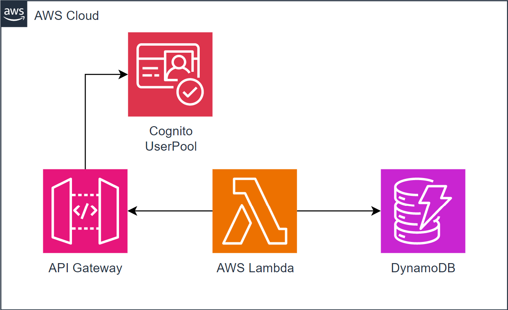

# task10
Serverless API + Cognito

### Notice
Uses 'tables_table' and 'reservations_table' aliases for resolving according DynamoDB table name.

## task10 diagram

## Lambdas descriptions

### Lambda `task-10-lambda-01`
processes API requests
